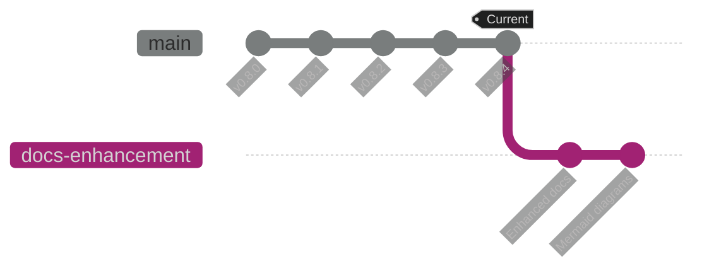
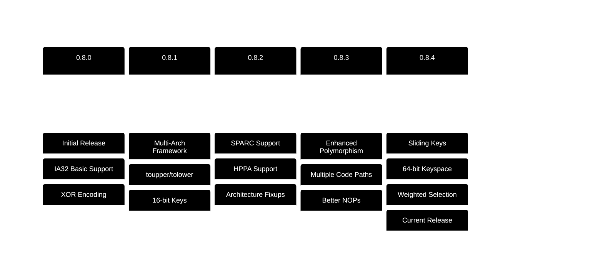
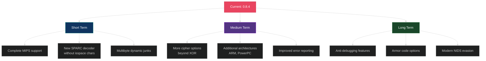

# Changelog

All notable changes to ADMmutate will be documented in this file.

The format is based on [Keep a Changelog](https://keepachangelog.com/en/1.0.0/),
and this project adheres to [Semantic Versioning](https://semver.org/spec/v2.0.0.html).

## [Unreleased]

### Added
- Comprehensive markdown documentation with mermaid diagrams
- `README.md` with structured sections and visual diagrams
- `docs/ARCHITECTURE.md` with system architecture visualizations
- `docs/API_REFERENCE.md` with complete API documentation
- `docs/GETTING_STARTED.md` with step-by-step tutorials
- `docs/EXAMPLES.md` with real-world usage examples
- `CONTRIBUTING.md` with contribution guidelines
- `CHANGELOG.md` for tracking version history
- `.gitignore` for build artifacts and temporary files
- Mermaid diagrams throughout documentation:
  - NIDS detection flowcharts
  - Polymorphic transformation diagrams
  - Technique mind maps
  - API sequence diagrams
  - Architecture class diagrams
  - State machines for encoding processes
  - Memory layout visualizations
  - Runtime execution flows

### Changed
- Documentation structure significantly improved
- All documentation now uses themed, colorized mermaid graphics

## [0.8.4] - Historical

### Added
- IA32_SLIDE architecture with sliding keys
- 64-bit effective keyspace (32-bit key + 32-bit slide)
- Defeats XOR reversal attempts
- Up to 55 NOP replacements on IA32
- Weighted instruction queuing for statistical distribution
- Out-of-order decoder generation
- Dynamic instructions (e.g., `ADD N, %EAX`)
- Offset modulation for return addresses
- Multiple architecture support (IA32, SPARC, HPPA)
- 2×16-bit key support (32-bit keyspace)
- Output to C-style char array (`-c` flag in m7)
- Buffer truncation option (`-t` flag in m7)
- DISABLE architecture support
- High-resolution random seeding:
  - SPARC: TICK register
  - HP: TIMER register  
  - ALPHA: PCC register (planned)
  - Pentium: TSC (Time Stamp Counter)
  - MIPS: COUNT register (planned)

### Changed
- Improved key search algorithm performance
- Enhanced decoder generation with more alternatives
- Better junk instruction selection
- Spell-checked documentation

### Removed
- DEBUG clutter from output
- Some inefficient key search paths

### Fixed
- Various instruction encoding issues
- Improved error reporting in some scenarios

## [0.8.3] - Historical

### Added
- Comprehensive NOP replacement system
- Multiple code path support per decoder instruction
- Non-operational padding capabilities

### Changed
- Refactored decoder generation for better polymorphism
- Improved instruction selection algorithm

## [0.8.2] - Historical

### Added
- SPARC architecture support
- HPPA architecture support (experimental)
- Architecture-specific fixup handlers
- Multiple junk instruction sets

### Changed
- Modularized architecture handling
- Improved cross-platform compatibility

### Known Issues
- HPPA: Instruction encoding issues, keep JMAX at 2
- HPPA: Requires special cache handling with fork() trick

## [0.8.1] - Historical

### Added
- Initial multi-architecture framework
- toupper() and tolower() resilience
- Banned character support
- Key search with constraints

### Changed
- Expanded from 8-bit to 16-bit keys
- Improved keyspace handling

## [0.8.0] - Historical

### Added
- Initial release
- Basic polymorphic engine for IA32
- XOR encoding with random keys
- Simple NOP replacement
- Basic decoder generation
- m7 mutation filter tool

### Features
- Signature evasion for NIDS
- Random instruction selection
- Multiple NOP alternatives
- Junk instruction padding

## Version History Summary

## Compatibility Matrix

| Version | IA32 | SPARC | HPPA | MIPS | Sliding Keys |
|---------|------|-------|------|------|--------------|
| 0.8.0   | ✅   | ❌    | ❌   | ❌   | ❌           |
| 0.8.1   | ✅   | ❌    | ❌   | ❌   | ❌           |
| 0.8.2   | ✅   | ✅    | ⚠️   | ❌   | ❌           |
| 0.8.3   | ✅   | ✅    | ⚠️   | ❌   | ❌           |
| 0.8.4   | ✅   | ✅    | ⚠️   | ❌   | ✅           |

Legend: ✅ Full Support | ⚠️ Partial/Experimental | ❌ Not Supported

## Platform Compatibility

### Tested Operating Systems

**0.8.4 Tested On:**
- Linux (various distributions)
- Solaris 2.x
- IRIX 6.x
- HP-UX 11
- OpenBSD 2.x
- FreeBSD 4.3
- NetBSD 1.x
- UnixWare 7.x
- OpenServer 5.x
- TRU64 5.x

### Compiler Compatibility

- GCC 2.95+
- GCC 3.x
- GCC 4.x
- Various vendor compilers (HP, Sun, etc.)

## Migration Guide

### From 0.8.3 to 0.8.4

**New Features:**
- IA32_SLIDE architecture available
- Sliding keys for enhanced security

**Breaking Changes:**
- None - fully backward compatible

**Recommendations:**
- Consider using IA32_SLIDE for IA32 targets
- Update exploits to use weighted junk instructions

### From 0.8.2 to 0.8.3

**New Features:**
- Out-of-order decoder generation
- Dynamic instruction support

**Changes:**
- Decoder structure expanded
- More alternatives per instruction

**Migration:**
- Recompile exploits with new ADMmuteng.o
- No API changes required

## Known Issues

### Current (0.8.4)

#### IA32
- Due to string calculations, subtract 1 from NOP count when passing to mutate functions
- Depends on how NOPs are used in your exploit

#### HPPA
- Instruction encoding issues present
- **Workaround**: Keep JMAX at 2 in ADMmutapi.h
- Cache flush handling requires fork() trick
- Limited to 11 junk instructions

#### MIPS
- Planned but not yet implemented
- Decoder skeleton exists but untested

### Resolved Issues

#### Fixed in 0.8.4
- Key search performance improved for constrained scenarios
- Better handling of edge cases in offset modulation
- Improved error messages

#### Fixed in 0.8.3
- Out-of-order generation edge cases
- Decoder length calculation errors

## Future Roadmap

### Planned Features

#### High Priority
- [ ] Complete MIPS architecture support
- [ ] SPARC decoder without isspace() characters
- [ ] Multibyte dynamic JUNK code (currently only 1-byte)
- [ ] More comprehensive error reporting

#### Medium Priority
- [ ] Additional reversible polymorphisms (beyond XOR)
- [ ] ARM architecture support
- [ ] PowerPC architecture support
- [ ] Improved code style and flexibility
- [ ] Performance optimizations

#### Low Priority
- [ ] Anti-debugging features
- [ ] Armor code options
- [ ] Modern NIDS evasion techniques
- [ ] GUI tool for configuration
- [ ] Python bindings

## Contributing

See [CONTRIBUTING.md](CONTRIBUTING.md) for guidelines on how to contribute to ADMmutate.

## Security

For security-related issues and vulnerability reports, see [SECURITY.md](SECURITY.md).

## License

ADMmutate is licensed under the GNU Affero General Public License v3.0. See [LICENSE](LICENSE) for details.

## Authors

- **K2** - Original author and maintainer
- See [CONTRIBUTING.md](CONTRIBUTING.md) for contribution information

## Acknowledgments

Special thanks to all contributors and the security research community for their feedback and support.

---

For more information, visit the [ADMmutate repository](https://github.com/K2/ADMMutate).

[Unreleased]: https://github.com/K2/ADMMutate/compare/v0.8.4...HEAD
[0.8.4]: https://github.com/K2/ADMMutate/releases/tag/v0.8.4
