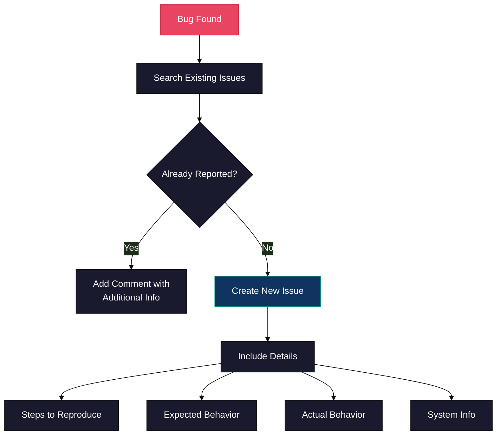
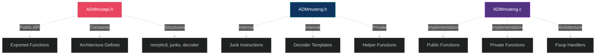
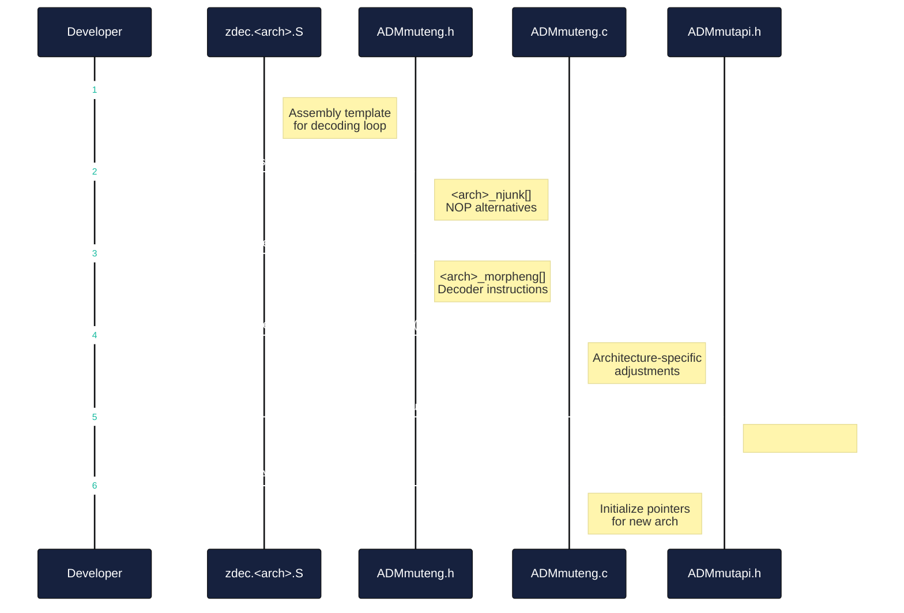
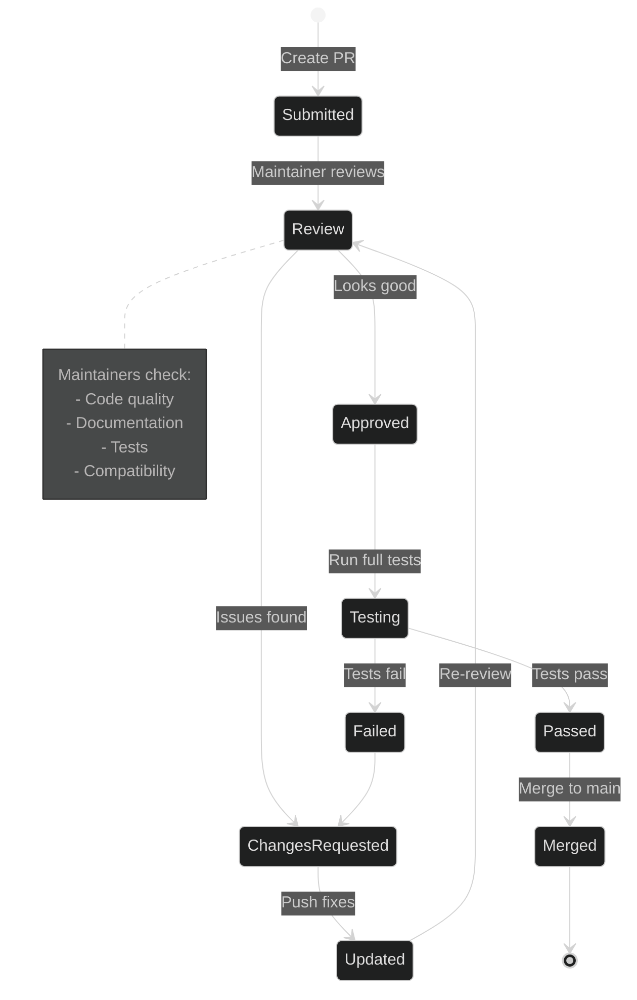

# Contributing to ADMmutate

Thank you for your interest in contributing to ADMmutate! This document provides guidelines and information for contributors.


## Ways to Contribute

### 🐛 Reporting Bugs

Found a bug? Help us improve by reporting it!



**What to Include:**

- **Title**: Clear, concise description
- **Environment**: OS, architecture, compiler version
- **Steps**: Exact steps to reproduce
- **Expected**: What should happen
- **Actual**: What actually happens
- **Code**: Minimal test case if possible

**Example:**
```markdown
### Bug: apply_key fails with tolower() and many banned chars

**Environment:**
- OS: Ubuntu 22.04 LTS
- Arch: x86_64
- GCC: 11.3.0

**Steps to Reproduce:**
1. Set `mut.lower = 1`
2. Set `mut.banned = "\x00\x0a\x0d\x20..."`  (20+ chars)
3. Call `apply_key()`

**Expected:** Find valid key or return error quickly
**Actual:** Hangs for 60+ seconds

**Code:**
[attach minimal test case]
```

### ✨ Feature Requests

Have an idea for improvement?

**Before Requesting:**
- Check existing issues and discussions
- Consider if it fits ADMmutate's scope (polymorphic shellcode mutation)
- Think about implementation complexity

**Feature Request Template:**
```markdown
### Feature: [Short Description]

**Problem**: What problem does this solve?

**Proposed Solution**: How should it work?

**Alternatives**: Other approaches considered?

**Use Case**: Real-world scenario where this helps?
```

### 📝 Documentation

Documentation improvements are always welcome!

**Areas for Contribution:**
- Fixing typos and grammar
- Adding examples
- Improving clarity
- Translating to other languages
- Creating tutorials
- Adding diagrams

### 🔧 Code Contributions

Ready to contribute code? Great!

## Development Setup

### 1. Fork and Clone

```bash
# Fork the repository on GitHub, then:
git clone https://github.com/YOUR_USERNAME/ADMMutate.git
cd ADMMutate
```

### 2. Create a Branch

```bash
git checkout -b feature/your-feature-name
# or
git checkout -b bugfix/issue-number-description
```

**Branch Naming:**
- `feature/` - New features
- `bugfix/` - Bug fixes
- `docs/` - Documentation
- `refactor/` - Code refactoring
- `test/` - Test additions/improvements

### 3. Build and Test

```bash
# Clean build
make clean
make

# Test your changes
./vulnerable `./exp | ./m7 -i -o 0xbffff63e -n 0x90`

# Test with different architectures if possible
```

## Coding Guidelines

### C Code Style

```c
// Function naming: lowercase with underscores
int apply_mutation(char *buffer, size_t len);

// Variable naming: descriptive, lowercase
unsigned int cipher_key;
int decoder_length;

// Constants: UPPERCASE
#define MAX_BUFFER_SIZE 2048
#define DEFAULT_ARCH IA32

// Structures: lowercase with underscores
struct mutation_context {
    int flags;
    char *data;
};

// Comments: Explain WHY, not WHAT
// Use decoder cache to avoid regeneration overhead
cache_decoder(mut);
```

### Code Organization



**Guidelines:**
- Keep public API minimal and stable
- Internal functions should be static
- Use meaningful variable names
- Comment complex algorithms
- Avoid platform-specific code where possible

### Adding a New Architecture



**Steps:**

1. **Create Decoder Skeleton** (`zdec.<arch>.S`):
```assembly
; Decoder template for ARCH
; Must decode XOR-encoded shellcode at runtime
decoder_start:
    ; Load key
    ; Setup counter
    ; Decode loop
    ; Execute decoded code
```

2. **Add Junk Instructions** (`ADMmuteng.h`):
```c
#define ARCH_JUNKS 25

struct junks arch_njunk[ARCH_JUNKS] = {
    { "\x01", 1, 1, 0, 1, 1, 0, 0, 1 },  // nop equivalent
    { "\x02", 1, 1, 0, 1, 1, 0, 0, 1 },  // another one
    // ... more junk instructions
};
```

3. **Add Decoder Instructions** (`ADMmuteng.h`):
```c
#define ARCH_DECINST 12

struct decoder arch_morpheng[ARCH_DECINST] = {
    { 2, 11, 0, 1, 1, 1, {"\x...", "\x..."} },  // Load key
    { 3, 111, 0, 2, 2, 1, {"\x...", "\x...", "\x..."} },  // Counter
    // ... more decoder parts
};
```

4. **Implement Fixup Handler** (`ADMmuteng.c`):
```c
static int mutate_fixup_arch(char *eng_space, size_t enc_amount, 
                              size_t tlen, struct morphctl mut) {
    // Architecture-specific adjustments
    // - Patch immediate values
    // - Fix offsets
    // - Handle endianness
    // - Special handling (e.g., HPPA cache flush)
    
    return 0;
}
```

5. **Add to init_mutate()** (`ADMmuteng.c`):
```c
case ARCH:
    morpheng = arch_morpheng;
    njunk = arch_njunk;
    mut->junk_pads = ARCH_JUNKS;
    mut->decoder_instructions = ARCH_DECINST;
    break;
```

6. **Add Constant** (`ADMmutapi.h`):
```c
#define ARCH 6  // Next available number
```

### Testing New Features

```bash
# Test basic functionality
make clean && make
./exp | ./m7 -i -o 0xbffff63e -n 0x90

# Test edge cases
./m7 -i -U -o 0xbffff63e -n 0x90 -x ./exp  # toupper
./m7 -i -l -o 0xbffff63e -n 0x90 -x ./exp  # tolower

# Test with banned chars
# (would need to add -b flag to m7)

# Test uniqueness
for i in {1..10}; do
    ./m7 -i -o 0xbffff67e -n 0x90 -x ./exp > test$i.bin
done
md5sum test*.bin  # All should be different
```

## Commit Guidelines

### Commit Message Format

```
<type>(<scope>): <subject>

<body>

<footer>
```

**Types:**
- `feat`: New feature
- `fix`: Bug fix
- `docs`: Documentation only
- `style`: Code style (formatting, no logic change)
- `refactor`: Code refactoring
- `test`: Adding tests
- `chore`: Build process, tooling

**Examples:**

```
feat(ia32): Add support for AVX instructions as junk NOPs

Added 15 new AVX instruction patterns that can be used as NOP
alternatives on modern x86 processors. These instructions are
longer (3-4 bytes) but increase the NOP alternative pool.

Closes #42
```

```
fix(key-search): Handle edge case when no keys available

Fixed crash when apply_key() is called with constraints that
eliminate all possible keys. Now returns proper error code
instead of segfaulting.

Fixes #38
```

```
docs(examples): Add remote exploitation tutorial

Added comprehensive example showing how to use ADMmutate for
remote exploitation scenarios with offset modulation.
```

### Commit Best Practices

- One logical change per commit
- Write clear, descriptive messages
- Reference issues when applicable
- Test before committing
- Keep commits atomic and focused

## Pull Request Process

### 1. Prepare Your PR

```bash
# Ensure your branch is up to date
git fetch origin
git rebase origin/main

# Run tests
make clean && make
# ... test your changes ...

# Commit your changes
git add .
git commit -m "feat(scope): description"
```

### 2. Create Pull Request

**PR Title:** Follow commit message format

**PR Description Template:**
```markdown
## Description
[What does this PR do?]

## Motivation
[Why is this change needed?]

## Changes
- [List key changes]
- [Be specific]

## Testing
- [ ] Built successfully on [OS]
- [ ] Tested with m7 demo
- [ ] Tested with vulnerable program
- [ ] All existing functionality works
- [ ] New tests added (if applicable)

## Related Issues
Closes #[issue number]
```

### 3. Code Review Process



**What We Look For:**
- ✅ Code follows project style
- ✅ Changes are well-tested
- ✅ Documentation is updated
- ✅ Commit messages are clear
- ✅ No breaking changes (or well-justified)
- ✅ Backwards compatible when possible

### 4. After Merge

- Delete your feature branch
- Update your fork
- Celebrate! 🎉

## Community Guidelines

### Code of Conduct

- **Be respectful**: Treat everyone with respect
- **Be constructive**: Offer helpful criticism
- **Be patient**: Remember everyone was new once
- **Be inclusive**: Welcome all skill levels
- **Be professional**: Keep discussions on-topic

### Getting Help

- **Documentation**: Read the docs first
- **Search**: Check existing issues
- **Ask**: Create a discussion or issue
- **IRC/Chat**: [If applicable]

## License

By contributing to ADMmutate, you agree that your contributions will be licensed under the GNU Affero General Public License v3.0.

## Recognition

Contributors are recognized in:
- Git commit history
- Release notes
- CHANGELOG.md
- Special thanks in README.md (for significant contributions)

## Questions?

Feel free to:
- Open a discussion on GitHub
- Email the maintainer: K2@ktwo.ca
- Comment on relevant issues

---

**Thank you for contributing to ADMmutate!** 🙏

Your efforts help make polymorphic shellcode mutation accessible to security researchers and penetration testers worldwide.
