# Security Policy

## Overview


## Supported Versions

ADMmutate is currently maintained for educational and research purposes. The following versions receive security updates:

| Version | Supported          | Status |
| ------- | ------------------ | ------ |
| 0.8.4   | :white_check_mark: | Current stable release |
| 0.8.3   | :white_check_mark: | Maintained |
| 0.8.2   | :x:                | Deprecated |
| < 0.8.2 | :x:                | No longer supported |

## Responsible Use

### ⚠️ Important Notice

**ADMmutate is designed for educational and authorized security research purposes only.**

```mermaid
%%{init: {'theme':'base', 'themeVariables': {'primaryColor':'#1a1a2e','primaryTextColor':'#fff'}}}%%
flowchart TD
    A[Using ADMmutate] --> B{Purpose?}
    
    B -->|Learning| C[✅ Acceptable]
    B -->|Authorized Pentest| D[✅ Acceptable]
    B -->|Security Research| E[✅ Acceptable]
    B -->|Unauthorized Access| F[❌ Illegal]
    B -->|Malicious Use| G[❌ Illegal]
    
    C --> H[Educational environments]
    D --> I[Written permission required]
    E --> J[Responsible disclosure]
    
    F --> K[Legal consequences]
    G --> K
    
    style C fill:#388e3c,stroke:#2e7d32,color:#fff
    style D fill:#388e3c,stroke:#2e7d32,color:#fff
    style E fill:#388e3c,stroke:#2e7d32,color:#fff
    style F fill:#e94560,stroke:#c72c48,color:#fff
    style G fill:#e94560,stroke:#c72c48,color:#fff
    style K fill:#6b2c2c,stroke:#8b3a3a,color:#fff
```



### Acceptable Use Cases

**✅ Approved Uses:**
- Educational purposes in controlled environments
- Authorized penetration testing with written consent
- Security research and academic study
- Personal learning in isolated lab environments
- CTF competitions and authorized challenges
- Development of defensive security tools

**❌ Prohibited Uses:**
- Unauthorized access to computer systems
- Malware development or distribution
- Attacking systems without explicit permission
- Circumventing security measures without authorization
- Any illegal activities

### Legal Compliance

Users must comply with all applicable laws and regulations, including:
- Computer Fraud and Abuse Act (CFAA) in the United States
- Computer Misuse Act in the United Kingdom
- Local cybersecurity and computer crime laws
- Terms of service of target systems

## Reporting a Vulnerability

### How to Report

If you discover a security vulnerability in ADMmutate, please report it responsibly:

**Contact:** K2@ktwo.ca

**What to Include:**


**Report Template:**

```
Subject: [SECURITY] <Brief Description>

Description:
[Detailed explanation of the vulnerability]

Impact:
[What can an attacker do? What data/systems are at risk?]

Affected Versions:
[Which versions are affected?]

Steps to Reproduce:
1. [First step]
2. [Second step]
3. [...]

Proof of Concept:
[Code or commands demonstrating the issue]

Suggested Fix:
[If you have ideas for fixing it]

Additional Notes:
[Any other relevant information]
```

### Response Timeline


- **Initial Response**: Within 3 business days
- **Investigation**: 7-14 days for analysis
- **Fix Development**: 14-30 days depending on severity
- **Coordinated Disclosure**: After fix is available

### Severity Levels

| Level | Criteria | Response Time |
|-------|----------|---------------|
| 🔴 **Critical** | Remote code execution, privilege escalation | 24-48 hours |
| 🟠 **High** | Information disclosure, DoS | 3-7 days |
| 🟡 **Medium** | Logic errors, minor security issues | 7-14 days |
| 🟢 **Low** | Best practice violations, hardening | Next release |

## Enhancement Suggestions

We welcome suggestions for improving ADMmutate's capabilities!

### Areas for Enhancement

#### 1. Instruction Weighting Customization

**Current State:** Fixed weights in code  
**Opportunity:** Many users never customize instruction weightings

**Suggestion:**
- Add programmatic API for setting weights
- Configuration file support
- Runtime weight adjustment

```c
// Proposed API
int set_junk_weight(int arch, int instruction_index, int weight);
int load_weight_config(const char *config_file);
```

#### 2. Stack Pointer Finding

**Current State:** Manual offset calculation  
**Opportunity:** Additional ESP/SP finding techniques

**Suggestion:**
- Add gadget-free SP discovery for code execution contexts
- FPU-based techniques
- Leverage common memory leaks

**Research Areas:**
- Modern ASLR bypass techniques
- Information leak exploitation
- Stack pivot gadgets

#### 3. Encoder Enhancements

**Current State:** XOR-based encoding  
**Opportunity:** Additional encoding algorithms

**Suggestions:**
- ADD/SUB encoding
- Rotation-based encoding
- Mixed cipher chains
- Architecture-specific encoding (e.g., AVX)

**Testing Framework:**
- Use `llvm-mca` for instruction timing analysis
- Use `llvm-exegesis` for performance profiling
- Build instruction databases for modern CPUs

#### 4. Modern Architecture Support

**Priority Targets:**
- ARM/ARM64 (Thumb mode)
- AArch64
- RISC-V
- x86-64 specific optimizations

#### 5. Anti-Analysis Features

**Suggestions:**
- Anti-debugging techniques
- Anti-emulation checks
- Sandbox detection
- VM detection

**Note:** These should be optional and clearly documented for responsible use.

### How to Submit Enhancement Ideas

1. **Check existing issues** for similar suggestions
2. **Open a GitHub Discussion** to get feedback
3. **Create a detailed proposal** with:
   - Problem statement
   - Proposed solution
   - Use cases
   - Implementation sketch (if applicable)
4. **Consider submitting a PR** if you can implement it

## Security Best Practices

### For Tool Users


**Recommendations:**
- Always use in isolated lab environments
- Never test on systems without authorization
- Keep exploitation tools and techniques private
- Practice responsible disclosure
- Maintain professional ethics

### For Developers

**Code Security:**
- Review all third-party contributions
- Test new features thoroughly
- Consider security implications
- Document security-relevant behavior
- Follow secure coding practices

**Supply Chain:**
- Verify dependencies
- Keep build tools updated
- Sign releases
- Provide checksums

## Coordinated Disclosure

We follow responsible disclosure practices:

1. **Private Notification**: Report sent to K2@ktwo.ca
2. **Acknowledgment**: We confirm receipt within 3 days
3. **Analysis**: We investigate and develop a fix
4. **Fix Released**: Security patch published
5. **Public Disclosure**: 30-90 days after fix (coordinated)
6. **Credit**: Reporter credited in release notes (if desired)

### Disclosure Timeline

- **Day 0**: Vulnerability reported
- **Day 1-3**: Acknowledgment sent
- **Day 3-30**: Investigation and fix development
- **Day 30-45**: Testing and validation
- **Day 45**: Patch released
- **Day 75-90**: Public disclosure (if appropriate)

## Security Hall of Fame

We recognize security researchers who responsibly disclose vulnerabilities:

<!-- This section will be populated as vulnerabilities are reported and fixed -->

*No security vulnerabilities have been reported yet.*

---

**Remember**: With great power comes great responsibility. Use ADMmutate ethically and legally.

For questions or concerns, contact: **K2@ktwo.ca**
