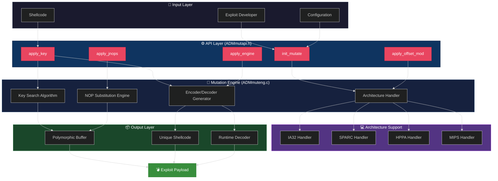
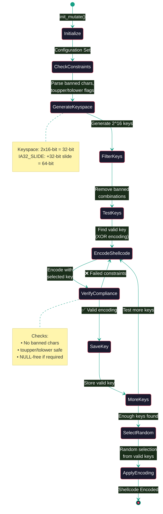
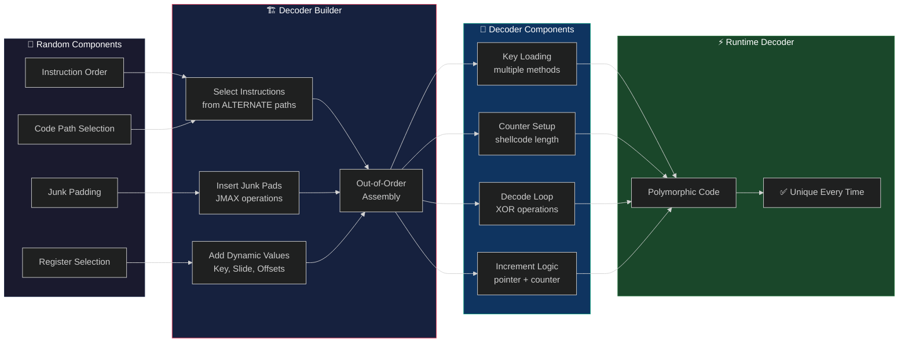
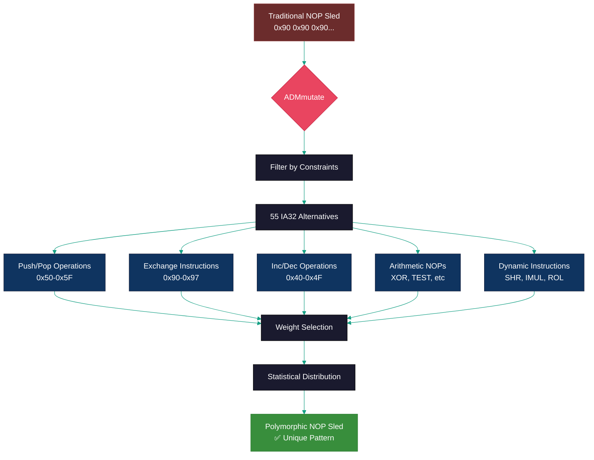
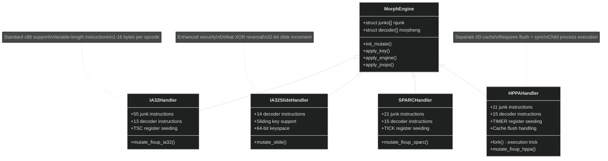
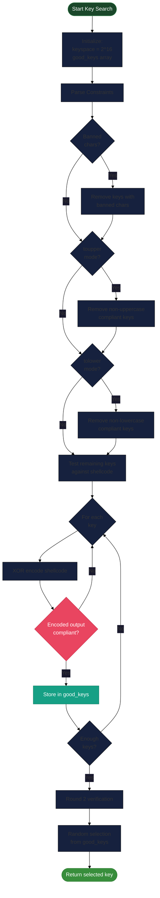
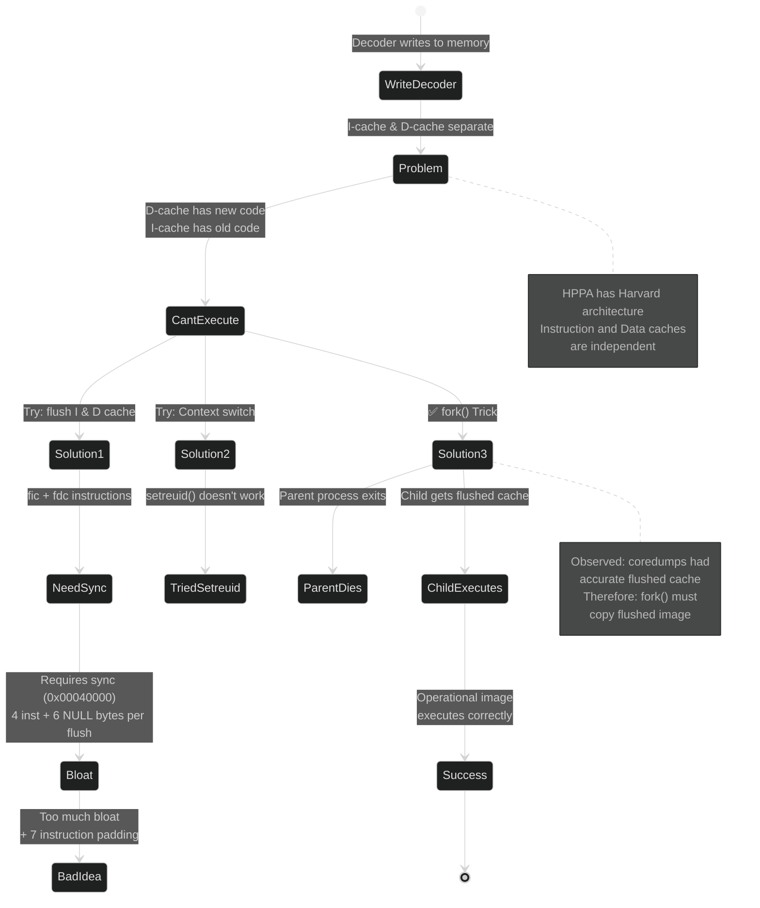
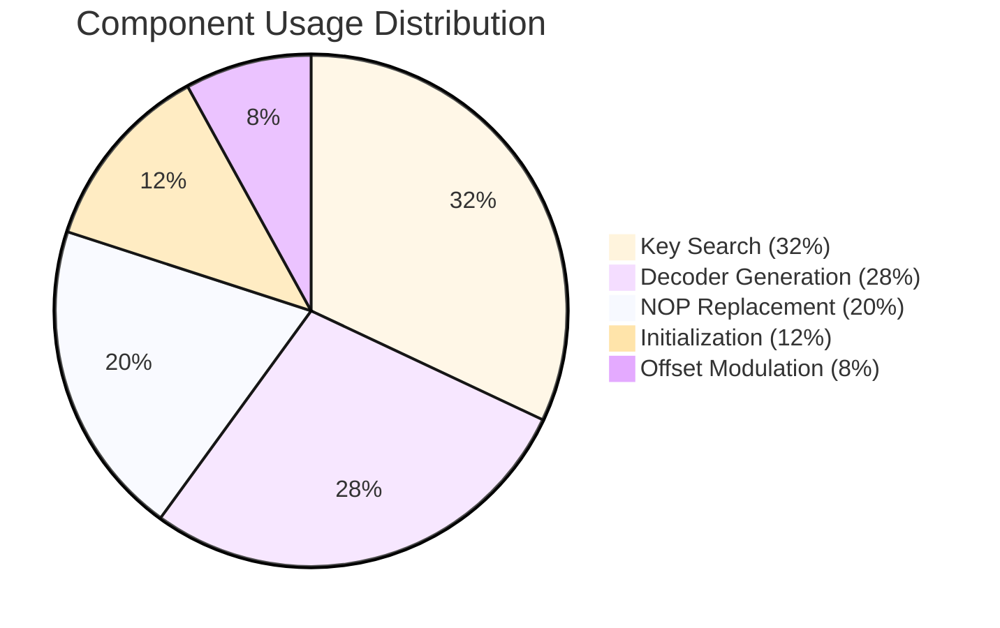

# Architecture Guide

## System Architecture



## Encoding Process Flow



## Decoder Generation Architecture



## NOP Replacement Strategy



## Architecture-Specific Handlers



## Key Search Algorithm



## Memory Layout

```mermaid
%%{init: {'theme':'dark'}}%%
graph TB
    subgraph Buffer["💾 Exploit Buffer (1024 bytes example)"]
        direction TB
        A["<div style='text-align:left'>Offset 0<br/>↓</div>"]
        B["🔀 Junk NOP Sled<br/>(499 bytes)<br/>Polymorphic instructions"]
        C["⚙️ Decoder Engine<br/>(65-72 bytes)<br/>Dynamic decoder"]
        D["🔒 Encoded Shellcode<br/>(52 bytes)<br/>XOR encrypted"]
        E["📍 Return Addresses<br/>(408 bytes)<br/>Modulated offsets"]
        F["<div style='text-align:left'>↑<br/>Offset 1024</div>"]
    end
    
    B -.->|Slides to| C
    C -.->|Decodes| D
    D -.->|Executes| G[/bin/sh]
    E -.->|Points to| B
    
    style B fill:#0f3460,stroke:#16a085,color:#fff
    style C fill:#533483,stroke:#7209b7,color:#fff
    style D fill:#e94560,stroke:#c72c48,color:#fff
    style E fill:#d68910,stroke:#b87333,color:#fff
    style G fill:#388e3c,stroke:#2e7d32,color:#fff
```

## Runtime Execution Flow

```mermaid
%%{init: {'theme':'base', 'themeVariables': {'primaryColor':'#1a1a2e','primaryTextColor':'#fff','lineColor':'#e94560'}}}%%
sequenceDiagram
    autonumber
    
    participant V as Vulnerable Program
    participant B as Exploit Buffer
    participant D as Decoder
    participant S as Shellcode
    participant OS as Operating System
    
    rect rgb(42, 42, 42)
    note right of V: Overflow Phase
    V->>B: Buffer overflow occurs
    V->>B: Return address overwritten
    end
    
    rect rgb(83, 52, 131)
    note right of B: Execution Redirect
    B->>B: CPU jumps to NOP sled
    B->>D: Slide through junk NOPs
    D->>D: Decoder starts executing
    end
    
    rect rgb(233, 69, 96)
    note right of D: Decode Phase
    loop For each DWORD
        D->>D: Load XOR key + slide
        D->>S: XOR decode 4 bytes
        D->>D: Increment key (if sliding)
        D->>D: Move to next DWORD
    end
    end
    
    rect rgb(22, 161, 133)
    note right of S: Shellcode Execution
    S->>S: Decoded shellcode ready
    S->>OS: execve("/bin/sh")
    OS-->>S: Shell spawned
    end
    
    rect rgb(56, 142, 60)
    note right of OS: Success
    OS->>V: ✅ Shell access granted
    end
```



## HPPA Cache Flush Architecture



## Component Interaction Matrix

| Component | init_mutate | apply_key | apply_jnops | apply_engine | apply_offset_mod |
|-----------|-------------|-----------|-------------|--------------|------------------|
| **Configuration** | ✅ Parse | ✅ Use | ✅ Use | ✅ Use | ✅ Use |
| **Junks Array** | ✅ Load | ❌ | ✅ Select | ❌ | ❌ |
| **Decoder Array** | ✅ Load | ❌ | ❌ | ✅ Select | ❌ |
| **Key Search** | ❌ | ✅ Execute | ❌ | ❌ | ❌ |
| **Buffer Write** | ❌ | ✅ Encode | ✅ Replace | ✅ Insert | ✅ Modulate |
| **Random Gen** | ❌ | ✅ Select | ✅ Select | ✅ Generate | ✅ Offset |



## Design Principles

### 🎯 Polymorphism First
Every execution must produce unique binary output while maintaining functional equivalence.

### 🔒 Security Through Obscurity
Multiple layers of randomization make pattern detection computationally expensive for NIDS.

### ⚡ Performance Conscious  
Efficient key search and caching strategies ensure rapid exploit generation.

### 🔧 Architecture Agnostic
Modular design allows easy addition of new CPU architectures.

### 📊 Statistical Distribution
Weighted selection ensures generated code matches real-world instruction frequency patterns.

---

**Previous**: [Getting Started](GETTING_STARTED.md) | **Next**: [API Reference](API_REFERENCE.md)
